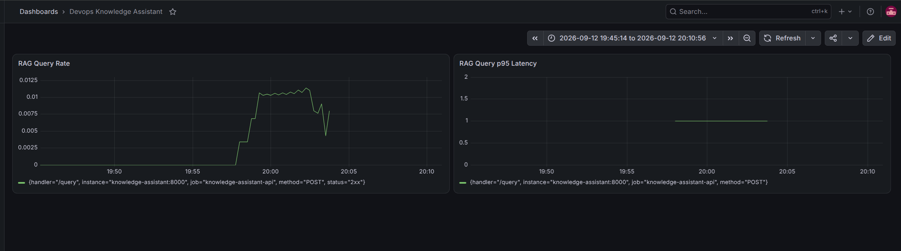

# DevOps Knowledge Assistant — Self-Service RAG Platform

A small but real implementation of the core capabilities behind an enterprise "AI
platform": model serving, an AI gateway, a vector database, eval-gated CI/CD,
observability, and basic governance — all running locally with free/open-source
tools.

**The use case:** engineering teams have runbooks, postmortems, and architecture
docs scattered across wikis. This platform lets them drop docs into a collection
and query them through a governed, observable API instead of grepping Confluence
at 2am during an incident.

This is deliberately built as a *platform*, not a chatbot demo: every piece maps
to a real enterprise AI-platform requirement, and the README below spells out
which one, so you can talk through the mapping in an interview.

---

## Architecture

```
                 ┌─────────────┐
   documents ──▶ │  ingest.py  │──▶ embeddings (sentence-transformers)
                 └─────────────┘            │
                                             ▼
                                      ┌─────────────┐
                                      │   Qdrant    │  (vector DB)
                                      └─────────────┘
                                             ▲
                                             │ retrieve
  client ──▶ [X-API-Key auth] ──▶ FastAPI /query
                  │                         │
                  │ (blocked or allowed,    ▼
                  │  redacted) ──▶   LiteLLM Proxy  (AI gateway: auth, rate limits, cost/token logging)
                  ▼                         │
          audit.db (SQLite,                 ▼
          on a Kubernetes PVC —        Ollama  (local LLM serving — llama3.2:3b)
          survives pod restarts,
          verified by killing a pod
          and re-reading the row)

  FastAPI also exposes /metrics ──▶ Prometheus ──▶ Grafana
  guardrails.py runs on every request (PII filter, prompt-injection check)
  eval/run_eval.py runs in CI on every change (grounding/faithfulness gate)
```

**Deployment targets — both run the identical stack, unmodified app code:**

- **Kubernetes (primary)** — a local `kind` cluster, provisioned by Terraform
  (`infra/terraform/`), running all 6 services as proper Deployments/Services
  (`k8s/`). This is the one that actually maps to the JD's "cloud-native
  infra, Kubernetes, IaC" requirements, and the one worth demoing.
- **Docker Compose (local dev)** — the original, simpler setup
  (`docker-compose.yml`), kept because it's faster to spin up for quick
  local iteration and because the debugging log below captures real,
  transferable lessons (dependency pinning, non-determinism, CI environment
  differences) that aren't specific to either deployment target.

Both were verified to produce **identical eval-gate results (4/4 pass)** —
this isn't an assumption, it was actually tested by running the same
`eval/run_eval.py` suite against both environments.

## Why each piece is here (map to platform-engineering requirements)

| Component | JD-style requirement it demonstrates |
|---|---|
| Qdrant | Vector databases |
| Ollama | Model serving frameworks |
| LiteLLM proxy | AI gateways, per-team API keys, developer self-service |
| `eval/run_eval.py` + GitHub Actions | MLOps/LLMOps CI/CD, model/prompt lifecycle management |
| Prometheus + Grafana | Observability, platform reliability |
| `guardrails.py` | Responsible AI, governance, auditability |
| `app/audit.py` | Durable audit logging (CloudTrail/Activity-Log style), auditability |
| API key auth on `/query` | Access control, defense-in-depth |
| `infra/terraform/` + `k8s/` | Cloud-native infra, IaC, Kubernetes |

## Running on Kubernetes (primary path)

```bash
# 1. Provision the local cluster
cd infra/terraform
terraform init
terraform apply

# 2. Point kubectl at it (path comes from the apply output)
export KUBECONFIG=$(terraform output -raw kubeconfig_path)
kubectl get nodes   # should show one Ready node

# 3. Build the app image and load it into the cluster
cd ..
docker build -t knowledge-assistant:local .
kind load docker-image knowledge-assistant:local --name devops-ai-platform

# 4. Deploy everything
kubectl apply -f k8s/qdrant.yaml
kubectl apply -f k8s/ollama.yaml
kubectl apply -f k8s/litellm.yaml
kubectl apply -f k8s/knowledge-assistant.yaml
kubectl apply -f k8s/prometheus.yaml
kubectl apply -f k8s/grafana.yaml
kubectl get pods   # wait for all to show 1/1 Running

# 5. Pull the model into the (fresh, unpersisted) Ollama pod
kubectl exec -it deployment/ollama -- ollama pull llama3.2:3b

# 6. Ingest sample docs (port-forward Qdrant so your host's ingest.py can reach it)
kubectl port-forward svc/qdrant 6333:6333 &
QDRANT_URL=http://localhost:6333 python app/ingest.py data/sample_docs
```

Then query it directly — **no port-forward needed** for the app itself,
because `k8s/knowledge-assistant.yaml` uses a `NodePort` Service mapped to
host port 8000 via the `extra_port_mappings` in `infra/terraform/main.tf`:

```bash
curl -X POST http://localhost:8000/query -H "Content-Type: application/json" \
  -d '{"question": "What are all the things I should check when an AKS pod is stuck in CrashLoopBackOff?"}'
```

Prometheus (`localhost:9090`) and Grafana (`localhost:3000`) are reachable
the same way — same NodePort pattern, no port-forwarding required. Grafana
setup is identical to the Compose version below, except the Prometheus data
source URL is still `http://prometheus:9090` — same value, but now resolved
via Kubernetes' own Service DNS rather than Docker Compose's.

**Known simplification:** Ollama has no PersistentVolume yet, so a pod
restart wipes the pulled model and step 5 needs re-running. A production
setup would mount a PersistentVolumeClaim, the Kubernetes equivalent of the
`ollama_data` named volume in `docker-compose.yml`.

## Running on Docker Compose (local dev alternative)

```bash
cp .env.example .env
docker compose up -d qdrant ollama litellm prometheus grafana

# pull a small local model (one-time, ~2GB)
docker exec -it ollama ollama pull llama3.2:3b

# install deps for the app + scripts (run on host, not in a container, for simplicity)
python -m venv venv && source venv/bin/activate
pip install -r requirements.txt

# ingest the sample runbooks
python app/ingest.py data/sample_docs

# run the API — must bind 0.0.0.0, not the default 127.0.0.1, or Prometheus
# (running in a container) can't reach it. See the debugging log below.
cd app
uvicorn main:app --reload --port 8000 --host 0.0.0.0
```

**Linux only:** if you have `ufw` (or another firewall) active, it will likely
block Prometheus's container from reaching the host on port 8000 by default.
See "Issue 5" in the debugging log below for the correctly-scoped fix
(don't just disable the firewall). Note this problem is specific to Compose
— see "Issue 6" for why it doesn't occur on Kubernetes.

Then:
```bash
curl -X POST localhost:8000/query -H "Content-Type: application/json" \
  -d '{"question": "What should I check first when an AKS pod is stuck in CrashLoopBackOff?"}'
```

Grafana: http://localhost:3000 (default admin/admin). Add a Prometheus data
source with URL `http://prometheus:9090` (container DNS name, not
`localhost` — Grafana and Prometheus are both containers on the same Compose
network). Two panels worth building first:

```
rate(http_requests_total{handler="/query"}[5m])        # request rate
histogram_quantile(0.95, rate(http_request_duration_seconds_bucket{handler="/query"}[5m]))   # p95 latency
```



## Running the eval gate locally

```bash
python eval/run_eval.py
```

This retrieves context and generates an answer for every question in
`eval/testset.yaml`, then checks that the answer is actually *grounded* in the
retrieved context (not hallucinated) and covers the expected key points. It
exits non-zero if the pass rate drops below threshold — that's the check
`.github/workflows/ci.yml` runs on every change, so a bad prompt or retrieval
change can't get merged silently. This is the "LLMOps CI/CD" piece most
DevOps-background candidates skip, and it's worth walking through explicitly.

## What's deliberately simple (and the honest way to talk about it)

- The eval check is a lightweight grounding/keyword-coverage check, not full
  RAGAS — good enough to demonstrate the *pattern* (gate merges on quality,
  not just tests passing) without needing a second LLM as judge. Swapping in
  RAGAS or a proper LLM-as-judge is a natural "next step" to mention.
- Guardrails are regex-based PII/prompt-injection checks, not a full
  NeMo Guardrails setup — same reasoning: demonstrates the governance
  *pattern* that an enterprise platform needs, cheaply and explainably.
- The Kubernetes manifests in `k8s/` are plain YAML, not Helm charts —
  enough to demonstrate the Deployment/Service/ConfigMap pattern correctly,
  but a real platform would template these with Helm (or Kustomize) for
  reuse across environments. Also, `infra/terraform/` currently only
  provisions the *cluster*; a further step would have Terraform apply the
  `k8s/` manifests too (via the `kubernetes` or `helm` Terraform provider)
  instead of running `kubectl apply` by hand.
- Ollama has no PersistentVolume on Kubernetes yet (see the Kubernetes
  section above) — a named-volume equivalent for model weights. **Update:**
  this stopped being a hypothetical gap — a Qdrant pod restart during the
  security work wiped its data and an Ollama restart wiped its pulled
  model, both in the same session, requiring re-ingestion and re-pulling.
  Real, recurring evidence this is a genuine next step, not a nice-to-have.
- **Security is deliberately partial, not absent.** Implemented so far:
  secret scanning (`gitleaks`, default + custom rules, CI-gated, correctly
  scoped to per-push commits — see Issues 8-9), image vulnerability
  scanning (Trivy — see Issue 10, OS layer patched, Python-layer CVEs
  bumped, unfixed/vendored findings named honestly rather than hidden), no
  hardcoded credentials anywhere (env-var references, Kubernetes `Secret`
  objects via `secretKeyRef`, real GitHub Actions repository secrets for
  CI — see Issue 11), API key authentication on `/query` itself (constant-
  time comparison via `secrets.compare_digest`, tested against all four
  cases: missing key, wrong key, correct key, and the unauthenticated
  `/health` readiness-probe exception — see Issue 12), durable audit
  logging (SQLite on a Kubernetes PVC, PII-redacted before storage,
  verified to survive an actual pod deletion, not just assumed to — see
  Issues 13-15), RBAC (`automountServiceAccountToken: false` on all 6
  workloads, since none of them ever call the Kubernetes API — verified by
  reading the actual mounted token before the fix and confirming the
  directory is gone afterward — see Issue 16), and two Kyverno policies in
  Audit mode (require non-root containers, disallow floating image tags —
  see Issue 17, where both policies turned out to have real bugs of their
  own, caught by testing against known-true and known-false cases rather
  than trusting a clean `kubectl apply`), plus the existing
  `guardrails.py` input/output filtering. **Not yet implemented**, and
  worth naming explicitly rather than glossing over: static analysis on
  `app/*.py` (SAST, e.g. SonarCloud), dynamic scanning of the running API
  (DAST, e.g. OWASP ZAP), and actually fixing the violations the Kyverno
  policies found (no manifest sets `runAsNonRoot`, and 5 of 6 images use a
  floating tag) — Audit mode reports the problem, it doesn't fix it.
  Given the CV skills this project maps against (SAST, DAST, RBAC,
  defense-in-depth), this is the most valuable remaining phase, not an
  afterthought.

## Debugging log — what actually broke, and how it was fixed

This project was built and debugged interactively, one verified step at a
time, rather than written once and assumed correct. The issues below are
real, in the order they were hit, with root cause and fix — this log is
arguably the most interview-relevant part of the repo, since anyone can
copy working code but this is the actual troubleshooting trail.

### Issue 1 — `openai` / `httpx` version conflict

**Symptom:** `TypeError: Client.__init__() got an unexpected keyword argument
'proxies'` on startup, inside the OpenAI SDK's own client construction.

**Root cause:** `requirements.txt` pinned `openai==1.51.0` but left `httpx`
(a transitive dependency) unpinned. Pip installed the newest `httpx`
(0.28.x), which removed the `proxies` argument from `httpx.Client.__init__`
— but `openai==1.51.0` still passes it internally. Two libraries that were
compatible when this repo was written drifted apart because one wasn't
pinned tightly enough.

**Fix:** pin `httpx==0.27.2` explicitly in `requirements.txt`, alongside
`openai`, instead of leaving it to resolve freely.

### Issue 2 — non-idempotent ingestion

**Symptom:** running `python app/ingest.py data/sample_docs` twice doubled
`points_count` in Qdrant (9 → 18) instead of leaving it unchanged.

**Root cause:** each chunk was assigned a random `uuid.uuid4()` on every
run, so re-ingesting unchanged content created new points instead of
updating existing ones.

**Fix:** derive each point's ID deterministically from its content
(`source filename + chunk text`, hashed with SHA-256, formatted as a UUID
via `uuid.UUID(bytes=digest[:16])` since Qdrant requires int or UUID IDs).
Re-ingesting identical content now overwrites the same point instead of
duplicating it — verified by ingesting twice in a row and confirming
`points_count` stayed at 9 both times.

### Issue 3 — flaky eval result traced to two separate causes

**Symptom:** `eval/run_eval.py` failed one case
("What should I check first when an AKS pod is stuck in CrashLoopBackOff?")
with `missing keywords: ['logs', 'oomkilled']` — but manually re-running the
same question sometimes *did* include those words.

**Investigation:** rather than guessing, retrieval was checked directly
(bypassing generation) to confirm the correct runbook chunk — containing
both "logs" and "OOMKilled" verbatim — was in fact being retrieved. It was.
So this wasn't a retrieval bug. Next, the same question was run 3 times in
a row through generation alone: all 3 answered narrowly (literal "first
step only"), while one earlier ad-hoc run happened to mention "OOMKilled."
That confirmed real non-determinism in the model's output, not a
consistent generation failure.

**Two real causes, two fixes:**
1. The eval question itself was genuinely ambiguous — "what should I check
   **first**" has a defensible literal reading (just step one). Reworded
   to "What are **all** the things I should check..." to remove the
   ambiguity rather than fight the model into overriding a reasonable
   reading of the original question.
2. Eval runs need reproducibility that a live chat UI doesn't — added a
   `temperature` parameter threaded through `answer_question()` →
   `generate_answer()`, and set `run_eval.py` to call it with
   `temperature=0` specifically for eval runs (live user queries still use
   `temperature=0.1`). Verified fixed by re-running the eval twice in a row
   and confirming an identical 4/4 pass both times.

### Issue 4 — CI failures (two separate bugs, both environment-specific)

**Symptom 1:** `guardrail-unit-tests` job failed with
`No module named pytest`.
**Root cause:** `pytest` was installed locally with a one-off
`pip install pytest` that was never added back to `requirements.txt` —
worked locally, broke in CI, which installs strictly from the file.
**Fix:** add `pytest==8.3.3` to `requirements.txt`.

**Symptom 2:** `eval-gate` job failed with
`OllamaException - Cannot connect to host ollama:11434 ... Temporary
failure in name resolution`.
**Root cause:** `litellm_config.yaml` hardcoded `api_base:
http://ollama:11434` — a Docker Compose–internal DNS name that only
resolves when LiteLLM and Ollama are containers on the same Compose
network. In CI, both run as plain processes directly on the GitHub Actions
runner (no Docker Compose involved), so there is no `ollama` hostname to
resolve.
**Fix:** parameterized the address via `api_base: os.environ/OLLAMA_API_BASE`
in `litellm_config.yaml`, then set that env var to the environment-correct
value in each place LiteLLM actually runs: `http://ollama:11434` in
`docker-compose.yml`, `http://localhost:11434` in the CI workflow step. Same
logical dependency, two different valid addresses depending on where the
process runs — a good example of why hardcoding infra addresses is fragile.

**Also added:** `needs: guardrail-unit-tests` on the `eval-gate` job, so the
slow, expensive job (pulls a 2GB model) doesn't run at all if the fast, free
job would have failed anyway — a "fail fast" pipeline design choice, not a
required fix.

### Issue 5 — Prometheus couldn't scrape the FastAPI app (three-layer network issue)

**Symptom:** Prometheus target showed `health: down`, first with a DNS
error, then (after a partial fix) `context deadline exceeded`.

This took three separate fixes, each addressing a different layer:

1. **DNS:** `host.docker.internal` didn't resolve at all inside the
   Prometheus container. Root cause: that hostname auto-resolves on Docker
   Desktop (Mac/Windows) but **not** on native Linux — it has to be
   explicitly mapped. Fix: added
   `extra_hosts: ["host.docker.internal:host-gateway"]` to the `prometheus`
   service in `docker-compose.yml`.
2. **Bind address:** DNS then resolved, but the connection timed out. Root
   cause: `uvicorn` was started without `--host`, which defaults to binding
   only `127.0.0.1` (loopback) — reachable from the host's own terminal, but
   not from a container reaching in via the Docker bridge network, even via
   `host.docker.internal`. Fix: start uvicorn with `--host 0.0.0.0` so it
   listens on all interfaces.
3. **Firewall:** still timing out. Root cause: `ufw` was blocking inbound
   traffic on the Docker bridge interface by default. First attempt —
   `sudo ufw allow in on docker0` — didn't work and was actually the wrong
   fix: `docker network inspect` showed this Compose project uses its own
   custom bridge (`devops-ai-assistant_default`, e.g. `br-72ab1c84ca03`),
   not the default `docker0` interface, because Compose always creates a
   dedicated bridge per project rather than using the shared default one.
   Fix: found the real interface with `ip link show | grep br-`, then
   scoped the firewall rule to it specifically —
   `sudo ufw allow in on br-72ab1c84ca03` — with `ufw` left **active**
   throughout, rather than disabling it wholesale (which was tried briefly
   as a diagnostic step, confirmed it was a firewall issue, and was
   immediately reverted in favor of the properly scoped rule).

**Why this is worth mentioning explicitly in an interview:** the wrong
first guess (`docker0`) plus the discipline to verify with
`docker network inspect` instead of assuming, and to scope the fix
narrowly instead of disabling the firewall, is a more realistic and more
convincing demonstration of network troubleshooting than if it had worked
on the first try.

### Issue 6 — `kind` cluster failed to create: port conflict with the running Compose stack

**Symptom:** `terraform apply` failed with `docker run ... failed with error:
exit status 125` when creating the `kind` cluster's node container.

**Root cause:** the Terraform config maps host ports 8000, 9090, and 3000
into the cluster (for the app, Prometheus, and Grafana respectively) — but
the Docker Compose stack was still running at the time, with `prometheus`
bound to 9090 and `grafana` bound to 3000. Two different container
runtimes both trying to claim the same host ports.

**Fix:** `docker compose down` before creating the `kind` cluster. This
also reflects the right mental model going forward: Compose and Kubernetes
are two alternative deployment targets for the same stack, not meant to run
simultaneously on the same ports.

### Issue 7 — Kubernetes app pod stuck in `ImagePullBackOff`

**Symptom:** (avoided, but worth documenting as a known `kind`-specific
gotcha) — deploying a locally-built image to a `kind` cluster without
`imagePullPolicy: Never` causes Kubernetes to try pulling the image from
Docker Hub by default, which fails since the image only exists locally.

**Root cause:** `kind load docker-image` copies an image directly into the
node's local image store — it does not register the image with any
registry. Kubernetes' default `imagePullPolicy` (`IfNotPresent` for tagged
images, `Always` for `:latest`) can still attempt a registry pull under
some conditions, and this is a well-known point of confusion specifically
with `kind` (a real cloud cluster wouldn't have this issue, since it always
pulls from a real registry like ACR/ECR).

**Fix:** set `imagePullPolicy: Never` explicitly in
`k8s/knowledge-assistant.yaml`, telling Kubernetes to only use what's
already on the node. Worth naming explicitly in an interview as a
`kind`-specific detail that wouldn't apply on AKS/EKS, where the equivalent
step is pushing to a real registry instead.

### Issue 8 — a real hardcoded secret, and five compounding problems in fixing it properly

**Symptom:** while doing a security pass mapped against SAST/DAST/secrets-
management practices, manual inspection found `LITELLM_MASTER_KEY` /
`LITELLM_API_KEY` hardcoded as the literal string `sk-local-dev-key` across
`docker-compose.yml`, `litellm_config.yaml`, `k8s/litellm.yaml`,
`k8s/knowledge-assistant.yaml`, and `.env.example` — all committed to a
public GitHub repo. This is a real, valuable finding by itself, but fixing
it *properly* surfaced five further, genuinely instructive problems.

**1. Off-the-shelf secret scanning missed it entirely.** Running
`gitleaks` (a standard open-source secret scanner) against the repo
reported "no leaks found." Verified this wasn't a broken tool by testing a
known AWS-format example key (the standard 20-character `AKIA...` placeholder AWS itself uses across its public documentation) in parallel — that
one WAS caught. Conclusion: pattern/entropy-based scanners are built to
catch known credential formats and high-entropy (random-looking) strings;
a short, human-readable, low-entropy placeholder like `sk-local-dev-key`
defeats both signals. **Fix:** wrote a custom `gitleaks` rule matching on
variable-name *context* (`api_key`, `master_key`, `password`, etc.
assigned to any string) rather than the value's randomness.

**2. The custom rule then over-matched its own fix.** After moving secrets
to `os.environ/...` references (the correct fix), the custom rule flagged
those safe reference strings too (`master_key: os.environ/LITELLM_MASTER_KEY`
matched just as "looking like" a secret assignment). **Root cause:** Go's
regex engine (which `gitleaks` uses) doesn't support lookahead assertions,
so "match this shape but not that one" can't be expressed directly.
**Fix:** narrowed the value character class to exclude `.`, since
`os.environ`/`os.getenv` both contain a dot early enough to fall below the
rule's 6-character minimum once the dot stops the match — a workaround
that exploits the specific shape of the safe pattern rather than needing
lookahead. One residual false positive (`api_key=LITELLM_API_KEY`, a
variable reference with no dot) couldn't be resolved by regex alone and
was handled via baseline instead — a deliberate, documented trade-off, not
an oversight.

**3. The baseline was built backwards on the first attempt.** A baseline
suppresses reviewed findings so they don't re-trigger on every future scan
(avoiding alert fatigue). The first version baselined the 4 real secrets
but *excluded* 2 known false positives — meaning the false positives would
have re-flagged forever, the opposite of what a baseline is for. **Fix:**
baseline should hold everything already reviewed, real or not.

**4. Hand-editing the baseline broke its own suppression mechanism.**
Attempted to redact the literal secret text from the baseline JSON
(reasoning: the report file itself was recommitting the old plaintext
secret on every edit — a real, separate finding). This was based on an
assumption that `gitleaks` matches baseline entries by `Fingerprint` alone.
That assumption was wrong for this version: a side-by-side test (identical
findings, one hand-edited copy vs. one untouched tool-generated copy)
showed the edited version stopped suppressing anything, while the
untouched one worked perfectly. **Fix:** never hand-edit a baseline file;
instead added a path-based `[allowlist]` entry excluding the baseline file
itself from being scanned at all — solving the self-leak problem without
touching tool-generated output.

**5. A file named `.gitleaks.toml` is silently auto-loaded on every
invocation, replacing default rules.** Discovered that running
`gitleaks detect` with **no** `--config` flag at all still picked up the
custom-only rule set, because `gitleaks` auto-discovers `.gitleaks.toml`
in the scan root. Since the custom config had no working `[extends]`,
this meant default AWS-key/GitHub-token/entropy detection was silently
disabled for the whole repo. Two attempted fixes —
`[extends] path = "..."` (no such file exists on disk; defaults are
compiled into the binary) and `[extends] useDefault = true` (accepted
without error, but verified via direct testing to not actually merge
default rules in this gitleaks version, 8.16.0) — both failed. **Robust
fix:** renamed the file to `.gitleaks-custom.toml`, deliberately outside
gitleaks' auto-discovery convention, and now run two explicit, independent
scans — `gitleaks detect --source .` (real, untouched defaults) and
`gitleaks detect --config .gitleaks-custom.toml --baseline-path ...` (the
custom rule) — verified separately, each confirmed working in isolation.

**Also caught before it caused a silent gap:** `actions/checkout` defaults
to a shallow clone (`fetch-depth: 1`, latest commit only). Since `gitleaks`
scans git *history*, a shallow clone would have made the CI job blind to
almost everything this issue is about — fixed with `fetch-depth: 0`.

**Why this whole arc is worth walking through in an interview, not just
summarizing:** every "fix" here was tested and several were found to be
wrong on the first attempt — the entropy assumption, the baseline
direction, the fingerprint-matching claim, two different `[extends]`
attempts. That's a more honest and more convincing demonstration of
security engineering than a clean one-shot fix would have been.

### Issue 9 — documenting Issue 8 tripped gitleaks' own default rule, revealing a CI design flaw

**Symptom:** the very next commit — adding Issue 8's write-up to this
README — failed CI. `gitleaks`'s built-in `aws-access-token` rule flagged
the literal AWS example key (the same one described in Issue 8, above)
quoted in the prose
above, in the OLD commit that introduced it. Removing the string in a new
commit and re-running still failed, reporting the exact same old commit as
the source.

**Root cause, and it's bigger than this one string:** `gitleaks detect`
scans full git *history* by default, every single run. That means any
commit that ever existed gets flagged forever, regardless of what later
commits fix — full-history scanning is the wrong design for a per-push CI
gate, which should ask "did this push introduce a new problem," not "has
this repo ever contained anything flaggable." A `--baseline-path` covers
the custom rule (see Issue 8), but the plain default-rule scan had no
baseline at all, so it would fail on this same finding forever.

**Fix:** two changes, one immediate, one architectural.
1. Rewrote the README line to avoid embedding a real-looking secret string
   at all, rather than fighting the scanner further — good hygiene
   independent of the tool.
2. Reworked `secret-scan` in CI to compute the commit range introduced by
   each push (`github.event.before..github.event.after`, falling back to
   the latest commit for first-pushes/PR events) and pass it to `gitleaks`
   via `--log-opts`, so both scans check only *new* commits. Full-history
   scanning remains valuable as a separate, periodic/manual audit — which
   is exactly what local `gitleaks detect --source .` runs during
   development already provide.

**Why this is a better answer than "I added an allowlist entry":**
recognizing that the scan's *scope* was architecturally wrong, rather than
patching around one specific false-positive-shaped string, is the kind of
judgment call worth naming directly if asked about CI/CD design decisions.

### Issue 10 — Trivy image scan: real fixes, a wrong assumption caught by re-scanning, and honest limits

**Symptom:** `trivy image knowledge-assistant:local` reported 178
vulnerabilities (3 CRITICAL, 53 HIGH). Overwhelming at a glance — the
right response is triage, not panic-patching everything.

**Triage:** ignore anything with no `Fixed Version` (no patch exists yet,
so no action is possible regardless of severity). Of what remained,
`python-multipart` (HIGH, DoS) and `pytest` (MEDIUM) were safe, direct
`requirements.txt` bumps; `starlette` and `transformers` were left alone
for now since bumping either is a major-version jump risking silent
breakage of FastAPI or `sentence-transformers` compatibility.

**A wrong assumption, caught by re-scanning rather than trusted:** added
`RUN pip install --no-cache-dir --upgrade pip setuptools wheel` to the
Dockerfile, assuming this would also address the OS-layer CVEs Trivy
found (`perl-base` CRITICAL, `gzip`/`libpcre2`/`libsqlite3` HIGH). A
re-scan showed the OS-layer HIGH+CRITICAL count **completely unchanged**
— `pip install --upgrade` only touches Python packages; it has zero effect
on Debian's `apt`-managed OS packages, a genuinely different package
manager. **Real fix:** added `RUN apt-get update && apt-get upgrade -y` to
patch the OS layer specifically. Re-scanning afterward confirmed it
actually worked this time: CRITICAL count 3 → 0, OS HIGH+CRITICAL 56 → 44,
and the base OS version itself changed (`debian 13.6` → `13.7`) —
independent proof the upgrade really ran, not just a hopeful reading of
the CVE list.

**What legitimately remains, and why it's not a gap to hide:** the
remaining ~44 OS findings (mostly `util-linux`-family CVEs, `libacl1`,
`libsystemd0`, `ncurses`) all show no `Fixed Version` — Debian hasn't
published patches yet. No Dockerfile change can fix a vulnerability with
no upstream fix available; re-scanning periodically, not once, is the
actual practice here.

**Also found, not chased further:** a *second*, older, vendored copy of
`setuptools` (70.3.0) and `msgpack` (1.1.2) appeared as HIGH after the fix
— almost certainly bundled inside another package's own dependency tree
(likely `torch` or `huggingface_hub`), separate from the top-level
`setuptools` our fix upgraded. Named honestly as a known residual gap
rather than claimed as fixed.

### Issue 11 — a stale hardcoded fallback quietly broke local auth, and revealed CI's auth was never enforced at all

**Symptom:** after rotating the LiteLLM secret (Issue 8) and rebuilding
for the Trivy fixes, re-running the local eval suite failed with
`openai.BadRequestError: No connected db.` — an error that sounds like a
database problem but isn't.

**Investigation:** rather than guess, searched for the exact error and
found it's a known, actively-discussed LiteLLM behavior: **the error
message is misleading.** LiteLLM only consults a database to validate a
*virtual key*; a request using the correct master key never reaches that
code path at all. "No connected db" on a master-key request means the key
being sent does **not** match the configured master key — a key mismatch,
not a missing database.

**Root cause, two compounding gaps in our own earlier fix:**
1. `app/config.py` still had `LITELLM_API_KEY = os.getenv("LITELLM_API_KEY", "sk-local-dev-key")`
   — Issue 8 updated Compose, the Kubernetes manifests, and `.env.example`,
   but this one hardcoded fallback was missed.
2. Nothing in the app ever called `load_dotenv()`. Docker Compose
   auto-injects `.env` into *containers*; the FastAPI app and
   `eval/run_eval.py`, run directly on the host, never saw `.env` at all.

Together: the host-run scripts fell back to the old `"sk-local-dev-key"`,
which no longer matched the real rotated master key Compose was correctly
using — a genuine mismatch, invisible until the actual key rotation made
the two values diverge.

**A second, more serious finding surfaced while fixing the first:**
checking why CI's `eval-gate` job had kept passing throughout this entire
session despite never setting `LITELLM_MASTER_KEY` anywhere revealed that
LiteLLM was very likely running with **no authentication enforced at all**
in CI — an unresolved `os.environ/LITELLM_MASTER_KEY` reference most
likely leaves the master key unset, meaning any bearer token (including
the stale local fallback) was silently accepted. Every earlier "green" CI
run in this session passed without ever exercising real authentication.

**Fix:**
1. `config.py`: removed the hardcoded fallback entirely
   (`os.environ["LITELLM_API_KEY"]` — fail loudly and immediately if
   unset, rather than silently authenticating with a stale default), and
   added an explicit `load_dotenv()` call so host-run scripts pick up
   `.env` the same way Compose does for containers.
2. Added `python-dotenv` to `requirements.txt` explicitly — it was
   previously only present as an *undeclared* transitive dependency of
   another package, which is fragile on its own regardless of this bug.
3. CI: added a real GitHub Actions repository secret (`CI_LITELLM_KEY`)
   and wired it into both the LiteLLM startup step and every Python step
   that needs `LITELLM_API_KEY` — closing the silent-no-auth gap with a
   properly-managed secret, not another hardcoded value.

**Why this is worth telling in full, not just "fixed a bug":** the
misleading error message, the discipline of searching for the exact error
rather than guessing, and finding a *second*, more serious problem (CI's
auth being silently disabled) purely as a side effect of fixing the first
— that sequence is a better demonstration of debugging judgment than
either fix would be alone.

### Issue 12 — adding API auth required propagating one new env var through five places, none optional

**Context:** added API key authentication to `/query` itself — a
`FastAPI` `Security` dependency reading an `X-API-Key` header, checked
with `secrets.compare_digest` rather than `==` (plain string equality
short-circuits on the first mismatched character, which leaks timing
information about how many leading characters were correct — a real,
if minor, side-channel; constant-time comparison avoids it entirely).

**What made this genuinely multi-step, not a one-line change:** a new
required env var (`APP_API_KEY`, no hardcoded fallback — same
no-fallback discipline as `LITELLM_API_KEY` after Issue 11) had to be
threaded through every place that runs this code: local `.env` and
`.env.example`, a new Kubernetes `Secret` (`app-credentials`, via
`secretKeyRef` — never a literal value in YAML), and a new GitHub
Actions repository secret (`CI_APP_KEY`) wired into both CI steps that
import `config.py`. Missing any single one of these fails loudly (a
`KeyError` at import time, by design) rather than silently — which is
exactly what happened with the CI step on the first push, caught and
fixed immediately rather than discovered later.

**Verified with the full test matrix, not just the happy path:** no key
→ `401 "Missing X-API-Key header."`; wrong key → `401 "Invalid API
key."`; correct key → `200` with a real answer; `/health` → `200` with
no key at all (deliberately excluded from auth, since Kubernetes'
`readinessProbe` has no way to supply credentials).

### Issue 13 — a Kubernetes Secret was created empty, from the wrong working directory

**Symptom:** after wiring `APP_API_KEY` through Kubernetes, `/query`
returned `401 "Invalid API key."` even with the correct key.

**Root cause:** `kubectl create secret generic app-credentials
--from-literal=api-key=$(grep APP_API_KEY .env | cut -d= -f2)` was run
from a directory without `.env` present, so the `$(...)` substitution
silently evaluated to an empty string — `kubectl` created the Secret
anyway, since an empty value is technically still valid input. No error
anywhere in the chain; the failure only surfaced as a downstream auth
mismatch.

**Fix:** deleted and recreated the Secret from the project root,
verified immediately by decoding it back
(`kubectl get secret ... | base64 -d`) and comparing directly against
`.env`'s value — the same "verify, don't trust it worked" discipline
this project has needed repeatedly. Also surfaced a second, easy-to-miss
fact: **Kubernetes does not automatically restart pods when a Secret
they reference changes** — the already-running pod kept using the old
(empty) value until `kubectl rollout restart` forced it to pick up the
correction.

### Issue 14 — same-tag image updates don't automatically reach running pods

**Symptom:** after rebuilding the app image (to add `audit.py`) and
`kind load docker-image`-ing it into the cluster, `kubectl apply`
reported the Deployment as `unchanged`, and the running pod's age (42
minutes) proved it was still serving the *old* image, despite a
successful build and load.

**Root cause:** the image tag (`knowledge-assistant:local`) never
changes between rebuilds, and `imagePullPolicy: Never` means Kubernetes
won't re-pull it — so nothing in the Deployment spec actually changed
from Kubernetes' point of view, even though the image *content* behind
that tag did. `kubectl apply` only acts on spec changes, not on "the
same tag now points to different bytes."

**Fix:** `kubectl rollout restart deployment/knowledge-assistant`,
which forces new pods regardless of whether the spec changed. **Real-
world equivalent worth naming:** production systems avoid this entirely
by tagging images uniquely per build (a git SHA, a build number) so a
new image is *always* a genuine spec change — `:local`/`:latest`-style
floating tags are a demo-project simplification, not a practice to
carry into production.

### Issue 15 — durable audit logging needed a genuine kill-and-recover test, and turned up two more real bugs along the way

**The actual test, not just the design:** wrote a row to the audit
database, deliberately ran `kubectl delete pod` on the pod that wrote
it, waited for a replacement pod to come up, and confirmed the exact
same row (same `id`, same original timestamp) was still there —
real proof a PersistentVolumeClaim was doing its job, not an assumption
based on `STATUS: Bound`.

**Bug found along the way — missing OS-level tool.** Inspecting the
database via `kubectl exec ... sqlite3 ...` failed with
`executable file not found` — a reasonable-looking fix
(`pip install sqlite3` in `requirements.txt`) would have been wrong:
Python's `sqlite3` *module*, used by `app/audit.py`, is already part of
the standard library; the missing piece was the separate `sqlite3`
*command-line binary*, an OS package (`apt`, not `pip`) needed only for
manual debugging, not by the app itself.

**A second bug while adding it — apt-get argument order.** The first
attempt, `apt-get upgrade -y && rm -rf /var/lib/apt/lists/* && apt-get
install -y sqlite3`, failed with "Unable to locate package": the cleanup
step deleted apt's package index *before* the install ran. Fix: reorder
so every install happens before the cleanup,
`apt-get upgrade -y && apt-get install -y sqlite3 && rm -rf /var/lib/apt/lists/*`.

**A real, substantive bug found by re-reading the code, not by an
error:** the audit log stored `req.question` (the raw, un-redacted
question) even though `output_check["sanitized_text"]` (the redacted
answer) was correctly stored for the answer field. If a question itself
contained PII, guardrails would correctly redact it before it reached
the LLM — but the audit trail would still have captured the original,
unredacted text, quietly defeating half the point of having redaction
at all. Fixed by logging `input_check["sanitized_text"]` instead,
before committing the feature rather than after.

**A new gitleaks false positive, from a fingerprint's commit-specific
nature.** The new `audit.log_request(api_key=api_key, ...)` calls
matched the custom secret-scanning rule from Issue 8 (`api_key=` shape),
purely because the *variable* is named `api_key` — same class of false
positive as the earlier `app/rag.py` one, but a **new** fingerprint,
since baseline fingerprints are tied to the specific commit that
introduced them. This is the commit-specific-baseline limitation flagged
as a known caveat back in Issue 8, now observed for real. Fixed the
same verified-safe way as before: generate a fresh, tool-produced scan,
merge only the genuinely new fingerprints into the existing baseline
programmatically, never hand-type or edit field values.

### Issue 16 — every pod had a live, unused Kubernetes API credential by default

**How this was found:** while scoping what RBAC should actually restrict
for this project, realized none of the 6 workloads (Qdrant, Ollama,
LiteLLM, the app, Prometheus, Grafana) ever call the Kubernetes API at
all — so a `Role`/`RoleBinding` granting narrow permissions isn't really
the relevant control; there's nothing legitimate for them to be granted
access *to*. Checked whether that meant the risk was purely theoretical,
by looking directly at a running pod:
`kubectl exec ... -- cat /var/run/secrets/kubernetes.io/serviceaccount/token`
returned a live, valid, decodable JWT — every pod gets one auto-mounted
by default, whether it uses it or not.

**Fix:** `automountServiceAccountToken: false` added to all 6 Deployment
pod specs — removing the unused credential entirely, rather than
granting it scoped permissions it would never exercise. Verified, not
assumed: after redeploying, the same `cat` command against the same
path returned "No such file or directory" — the mount point itself was
gone, not just empty.

**What broke while verifying it, and why it was unrelated:** redeploying
all 6 manifests recreated the Qdrant and Ollama pods, which — per
Issues 5, 6, 13, and 15 — still have no PersistentVolume. This is now
the **fourth** time this exact gap has caused a real interruption in
this session, which has turned it from a documented "known
simplification" into a genuine, evidence-backed priority for the next
piece of work, not a footnote.

### Issue 17 — two Kyverno policies, both with real bugs, both found by testing against a known-true case

**Context:** wrote two Kyverno `ClusterPolicy` resources in `Audit` mode
(reports violations, blocks nothing) — require non-root containers, and
disallow floating image tags. Deliberately Audit rather than Enforce,
since every one of our own images uses a floating tag (`qdrant:latest`,
`ollama:latest`, `litellm:main-latest`, `prometheus:latest`,
`grafana:latest`) and Enforce would have immediately blocked our own
cluster.

**Bug 1 — the non-root policy was a silent no-op.** The first version
used Kyverno's `=(...)` conditional-anchor syntax, which means "if this
field is present, it must match" — not "this field must be present."
Since no manifest sets `securityContext` at all, the field was simply
absent everywhere, the anchor had nothing to check, and the policy
reported `pass` for every single workload, including ones verified by
hand to have no `securityContext` anywhere. **Caught by testing against
a known-true case** (checking the actual report for `knowledge-assistant`
specifically, a workload known for certain to violate the rule) rather
than trusting the policy applied cleanly. **Fix:** removed the
conditional anchors so the field is genuinely required; re-verified the
same known-true case now correctly reports `fail`.

**Bug 2 — the tag policy had a substring blind spot.** The first version
checked for the exact substring `:latest`. `litellm`'s image is tagged
`main-latest` — the full string contains `:main-latest`, not `:latest`,
so it silently passed despite being just as floating a tag as any other.
**Predicted this gap before even testing it** (worth noting: predicting
a bug and then confirming it empirically is a stronger habit than either
alone), then confirmed it directly in the policy report, then fixed it
by checking for `latest` anywhere in the string rather than requiring an
exact `:latest` match — a deliberately named trade-off, since this
wider check could in principle also flag a repository path that merely
contains the word "latest" without it being the actual tag; acceptable
here since Audit mode blocks nothing and none of our real images hit
that edge case.

**Final verification, not just individual spot-checks:** wrote a script
querying every Deployment's `PolicyReport` at once, confirming all 6
workloads now correctly fail `require-non-root`, and exactly the 5 with
a real floating tag fail `disallow-latest-tag` (`knowledge-assistant`,
pinned to `:local`, correctly passes) — a full matrix check, not just
confirming the two cases that were already known to be wrong.

## Interview talking points

- "I built the AI-specific layer (vector search, model serving, gateway) the
  same way I've always built platforms: IaC-able, observable, and gated by
  automated checks before anything ships."
- Walk through `run_eval.py` and explain *why* eval-gating matters for LLM
  changes specifically (non-deterministic output means "tests pass" isn't
  enough — you need to gate on answer quality/grounding).
- Be upfront about what's simplified and what the production version would
  add (RAGAS, NeMo Guardrails, Helm/Kustomize, a real model registry via
  MLflow, Terraform-managed Helm releases) — this signals platform-engineering
  judgment, not just tool usage.
- The debugging log above is the most concrete evidence of hands-on
  troubleshooting in this repo — the network/firewall issue (Issue 5) in
  particular is a good default answer to "tell me about a time you debugged
  a tricky infrastructure problem," and Issues 6-7 are good, specific
  answers to "what's different about running this on Kubernetes vs. Compose."
- Both deployment targets were verified to produce identical eval-gate
  results (4/4 pass) — a concrete way to say "I proved the migration was
  correct" instead of just "I migrated it."
- Issue 8 (secrets/secret-scanning) is the strongest security story in the
  repo: a real finding, a genuinely nuanced tool limitation (entropy-based
  scanning missing low-entropy secrets), a hard engine constraint (no
  regex lookahead in Go/RE2), and two of my own assumptions proven wrong by
  direct testing before landing on the robust fix. Good default answer to
  "tell me about a security issue you found and fixed yourself."
- Issue 9 is a good answer to "how do you design CI/CD for security
  gates" — recognizing full-history scanning was the wrong scope for a
  per-push gate, not just patching the specific failure.
- Issue 10 is a good answer to "how do you handle vulnerability scan
  results" — triage by fixability, verify fixes by re-scanning rather than
  trusting the change, and catch your own wrong assumption (pip vs. apt)
  before claiming victory.
- Issue 11 is arguably the best story in the repo for "tell me about a bug
  that turned out worse than it looked" — a misleading error message, a
  root cause found by searching rather than guessing, and a second, more
  serious problem (CI silently running with no authentication) discovered
  purely as a side effect of fixing the first.
- Issues 12-15 (API auth + durable audit logging) are good answers to
  "how do you approach access control and auditability" — a real,
  tested-against-all-cases auth check, a genuinely verified persistence
  test (kill the pod, prove the data survives, don't just trust the PVC
  status), and catching a real PII-redaction gap (the audit log storing
  raw rather than sanitized question text) by re-reading the code rather
  than waiting for it to fail.
- Issues 16-17 (RBAC + Kyverno) are a good answer to "how do you approach
  least privilege in Kubernetes" — recognizing that the relevant risk was
  an unused, auto-mounted credential rather than missing RBAC grants, and
  that both Kyverno policies looked correct but were silently no-ops or
  had real blind spots until tested against cases already known to be
  true or false, not just applied and trusted.